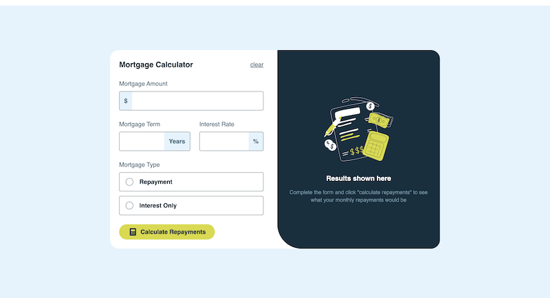
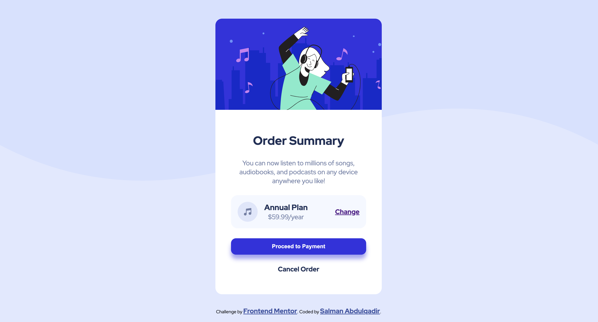

# Frontend Mentor Challenges

This repository contains my solutions to various Frontend Mentor challenges.

## Completed Projects

Here's a list of completed projects with links to their Frontend Mentor pages, preview images, and live demo links:

### 1. Mortgage repayment calculator

This mortgage calculator is an excellent project for practicing working with forms, client-side validation, and updating the DOM.

- [Preview](https://fe-mentor-mortgage.netlify.app/)

- [Frontend Mentor Challenge Page](https://www.frontendmentor.io/challenges/mortgage-repayment-calculator-Galx1LXK73)

- Technologies used: React, Tailwind CSS, TypeScript, Vite

- Instructions

```bash
  git clone https://github.com/your-username/frontend-mentor-challenges.git
  git checkout mortgage-repayment-calculator
```



### 2. Order Summary Component

A perfect project for newbies who are starting to build confidence with layouts!

- [Preview](https://salman-abdulqadir.github.io/frontend-mentor-challenges/)

- [Frontend Mentor Challenge Page](https://www.frontendmentor.io/challenges/order-summary-component-QlPmajDUj)

- Technologies used: HTML, CSS

- Instructions

```bash
  git clone https://github.com/your-username/frontend-mentor-challenges.git
  git checkout order-summary-component
```


